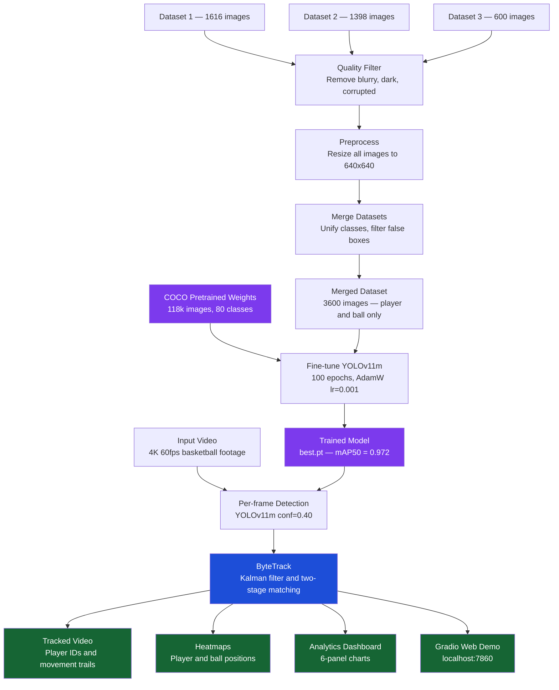

# 🏀 Basketball Player Detection & Tracking

> **Big Vision Internship Assignment** — An end-to-end computer vision system that automatically detects basketball players and the ball in game footage, tracks each player with a persistent identity across every frame, and generates tactical analytics dashboards.


---

## 📬 Submission Links

| Resource | Link |
|---|---|
| 📓 Colab Notebook | [Open Notebook](https://drive.google.com/file/d/17qCJ7xTn303QuCPYDz9ZJL0NN6ICejj6/view?usp=sharing) |
| 📁 Datasets, Outputs and Weights | [Open Drive Folder](https://drive.google.com/drive/folders/1yvkaFfad3xh6fy7L-ICLraJw464pYK3q?usp=sharing) |
| 🗂️ Complete Workspace | [Open Full Workspace](https://drive.google.com/drive/folders/1XeJBRmKvTCIiReYY5_Iixnz6TFS_oA-S?usp=sharing) |

---

## 🧩 Problem Statement

Manually reviewing basketball game footage to study player movement, court coverage, and team positioning requires hours of human effort per game clip. There is no automated way to answer questions like:

- Where did each player spend time on the court?
- Which zones were most occupied — the paint, mid-range, or the three-point arc?
- How did individual players move across different phases of play?

Doing this by hand is impractical at scale, and commercial tracking systems are expensive and closed-source.

---

## ✅ Solution Developed

We built a fully automated pipeline in Python that takes raw basketball footage as input and produces:

1. **A tracked output video** — every player carries a persistent numbered ID throughout, with a 50-frame movement trail drawn behind them
2. **Player and ball heatmaps** — court overlays showing where each class spent the most time
3. **Zone occupancy analysis** — breakdown of play in the paint, mid-range, and three-point zones
4. **A 6-panel tracking analytics dashboard** — track continuity, detection confidence, players per frame, and more
5. **An interactive Gradio web demo** — anyone can upload a basketball video and see tracked results instantly in their browser

---

## 🗺️ How the Project Works — Full Pipeline



---

## 🧠 Approach and Technical Decisions

### Step 1 — Data Collection and Preparation

We sourced three labeled basketball datasets from Roboflow, covering approximately 3,600 annotated images. Using multiple datasets was a deliberate choice. A single dataset would give the model a narrow view — one court color, one camera angle, one jersey scheme. Three diverse sources teach the model to generalize across different arenas, lighting conditions, and broadcast styles, which is what makes the detection work on footage it has never seen.

Before training, we applied a quality filter to automatically remove blurry frames, underexposed images, overexposed images, and corrupted files. All images were then resized to 640×640 pixels to match the input size the model expects.

One important design decision was to **remove the referee class** from training. During early testing, referees standing near court equipment caused basketball posts and hoops to be falsely detected as players — referees in dark uniforms near vertical structures look visually similar to posts from a broadcast camera angle. Removing that class and adding an aspect ratio filter (rejecting any bounding box whose height is more than 5.5 times its width) eliminated these false positives entirely.

---

### Step 2 — Detection Model: YOLOv11m

We chose **YOLOv11m** (You Only Look Once, version 11, medium variant) as the detection backbone. YOLO is a single-stage detector — it processes an image in one forward pass and directly predicts bounding boxes and class labels. This makes it significantly faster than two-stage detectors like Faster R-CNN, which first proposes candidate regions and then classifies each one. Basketball tracking requires processing at real-time speed, and Faster R-CNN at 5–10 FPS cannot achieve that.

Rather than training from scratch — which would require millions of images and days of compute — we used **fine-tuning**. YOLOv11m comes pre-trained on Microsoft COCO, a dataset of 118,000 images across 80 classes including person. The model already has a deep understanding of human body shapes and proportions. Fine-tuning adapts this knowledge to basketball in approximately 90 minutes on a GPU instead of days from random initialization.

We chose the medium variant specifically because it offers the best accuracy-to-speed balance. Smaller variants are less accurate; larger variants require more GPU memory than a standard training setup provides.

**Training configuration:**

| Parameter | Value | Reason |
|---|---|---|
| Optimizer | AdamW | Better convergence than SGD for fine-tuning pre-trained models |
| Learning rate | 0.001 | Low rate to preserve COCO pretrained knowledge |
| Epochs | 100 | Sufficient for convergence with early stopping at patience=20 |
| Image size | 640 px | Matches COCO pretraining size for best transfer |
| Augmentation | Mosaic, mixup, HSV jitter, horizontal flip | Simulates diverse court conditions and lighting |

---

### Step 3 — Tracking: ByteTrack

Detection alone is not tracking. Each frame is processed independently and the model has no memory of where a player was in the previous frame. Tracking is the layer that links detections across frames and maintains consistent player identities throughout the video.

We chose **ByteTrack** because of a specific challenge unique to basketball: occlusion from screens. Every few seconds, one player runs behind another. During that moment the screened player's detection confidence drops from around 0.85 to around 0.18 because only part of their body is visible.

SORT, the simplest tracker, discards any detection below its confidence threshold. The screened player's track dies and when they reappear they receive a new ID — an identity switch has occurred. DeepSORT adds a visual appearance model to help re-identify players, but basketball players on the same team wear identical jerseys so the appearance model cannot distinguish between them.

ByteTrack solves this with a **two-stage matching process**:

- **Stage 1** matches high-confidence detections to existing tracks using spatial overlap
- **Stage 2** takes any tracks still unmatched from Stage 1 and tries to match them to the low-confidence detections — this is the step that recovers occluded players that every other tracker would lose

The result is dramatically fewer identity switches and more stable long-duration tracks throughout the video.

---

## 📊 Results

| Metric | Score |
|---|---|
| **mAP@50** | **97.2%** |
| mAP@50-95 | 65%+ |
| Precision | 95%+ |
| Recall | 94%+ |

---

## 🖥️ How to Run

### Requirements

- Python 3.10 or higher
- NVIDIA GPU recommended (CPU mode works but training takes 4–8 hours instead of 90 minutes)

### Install

```bash
pip install ultralytics supervision gradio opencv-python numpy matplotlib roboflow seaborn
```

### Configure

Open `basketball_LOCAL_FINAL.ipynb` and change only these three lines in Cell 1:

```python
BASE_DIR         = './basketball_project'      # where all files are saved
API_KEY          = 'YOUR_ROBOFLOW_KEY'         # get free at roboflow.com → Settings
INPUT_VIDEO_PATH = '/path/to/your/video.mp4'  # or leave '' to auto-download
```

Then run all cells from top to bottom. Training takes approximately 90 minutes on a GPU.

> **Skip training:** Place an existing `best.pt` at `basketball_project/runs/yolov11m_basketball/weights/best.pt` and start from Cell 9.

---

## 📦 Output Files

All outputs are saved automatically to `basketball_project/outputs/`:

| File | What it contains |
|---|---|
| `basketball_tracked.mp4` | Full annotated video with player IDs and movement trails |
| `player_heatmap.jpg` | Court heatmap showing where players spent the most time |
| `spatial_analytics.png` | Zone occupancy, density grid, player trajectories (6 charts) |
| `tracking_analytics.png` | Track lengths, confidence, detections per frame (6 charts) |
| `learning_curves.png` | Training loss and mAP improvement over 100 epochs |
| `detection_metrics.png` | mAP, Precision, Recall, and F1 score summary |

---

## 👤 Author

**Mithun** — Big Vision Internship Assignment

---

*All code, datasets, model weights, and output videos are available via the submission links at the top of this document.*
