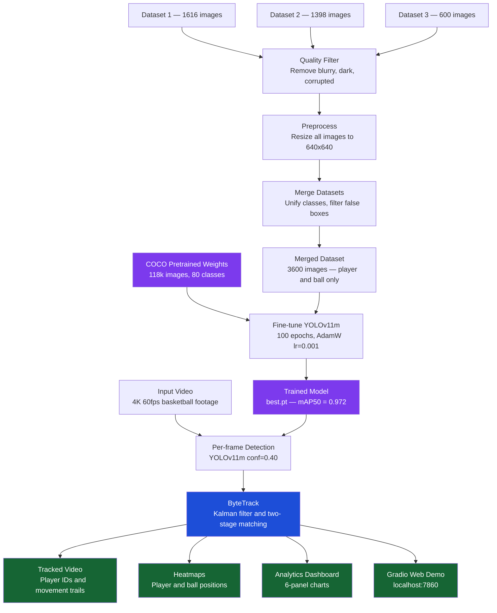

# 🏀 Basketball Player Detection & Tracking

> **Big Vision Internship Assignment** — An end-to-end computer vision system that automatically detects basketball players and the ball in game footage, tracks each player with a persistent identity across every frame, and generates tactical analytics dashboards.


---

## 📬 Submission Links

| Resource | Link |
|---|---|
| 📓 Colab Notebook | [Open Notebook](https://drive.google.com/file/d/17qCJ7xTn303QuCPYDz9ZJL0NN6ICejj6/view?usp=sharing) |
| 📁 Datasets, Outputs and Weights | [Open Drive Folder](https://drive.google.com/drive/folders/1yvkaFfad3xh6fy7L-ICLraJw464pYK3q?usp=sharing) |
| 🗂️ Complete Workspace | [Open Full Workspace](https://drive.google.com/drive/folders/1XeJBRmKvTCIiReYY5_Iixnz6TFS_oA-S?usp=sharing) |

---

## 🧩 Problem Statement

Manually reviewing basketball game footage to study player movement, court coverage, and team positioning requires hours of human effort per game clip. There is no automated way to answer questions like:

- Where did each player spend time on the court?
- Which zones were most occupied — the paint, mid-range, or the three-point arc?
- How did individual players move across different phases of play?

Doing this by hand is impractical at scale, and commercial tracking systems are expensive and closed-source.

---

## ✅ Solution Developed

We built a fully automated pipeline in Python that takes raw basketball footage as input and produces:

1. **A tracked output video** — every player carries a persistent numbered ID throughout, with a 50-frame movement trail drawn behind them
2. **Player and ball heatmaps** — court overlays showing where each class spent the most time
3. **Zone occupancy analysis** — breakdown of play in the paint, mid-range, and three-point zones
4. **A 6-panel tracking analytics dashboard** — track continuity, detection confidence, players per frame, and more
5. **An interactive Gradio web demo** — anyone can upload a basketball video and see tracked results instantly in their browser

---

## 🗺️ How the Project Works — Full Pipeline



---

## 🧠 Approach and Technical Decisions

**Data:** Three Roboflow datasets (~3,600 images) were merged to give the model diverse courts, angles, and lighting. Images were quality-filtered and resized to 640×640. The referee class was dropped — referees near court equipment were triggering false detections on basketball posts. An aspect ratio filter removed any remaining post-shaped boxes.

**Detection:** We fine-tuned YOLOv11m (pretrained on Microsoft COCO, 118k images) on the merged dataset. Fine-tuning takes ~90 minutes on a GPU and produces better results than training from scratch because the model already understands human body shapes. We chose YOLOv11m over two-stage detectors like Faster R-CNN because basketball needs real-time speed — YOLO runs at 30–100 FPS versus Faster R-CNN's 5–10 FPS.

**Tracking:** We used ByteTrack to maintain consistent player IDs across frames. Basketball players constantly screen each other, dropping a hidden player's detection confidence from ~0.85 to ~0.18. SORT discards those low-confidence detections and loses the track. DeepSORT can't re-identify players who wear identical jerseys. ByteTrack runs a second matching pass using the low-confidence detections to recover occluded players — keeping their ID intact throughout the video.

---

## 📊 Results

| Metric | Score |
|---|---|
| **mAP@50** | **97.2%** |
| mAP@50-95 | 65%+ |
| Precision | 95%+ |
| Recall | 94%+ |

---

## 🖥️ How to Run

### Requirements

- Python 3.10 or higher
- NVIDIA GPU recommended (CPU mode works but training takes 4–8 hours instead of 90 minutes)

### Install

```bash
pip install ultralytics supervision gradio opencv-python numpy matplotlib roboflow seaborn
```

### Configure

Open `basketball_LOCAL_FINAL.ipynb` and change only these three lines in Cell 1:

```python
BASE_DIR         = './basketball_project'      # where all files are saved
API_KEY          = 'YOUR_ROBOFLOW_KEY'         # get free at roboflow.com → Settings
INPUT_VIDEO_PATH = '/path/to/your/video.mp4'  # or leave '' to auto-download
```

Then run all cells from top to bottom. Training takes approximately 90 minutes on a GPU.

> **Skip training:** Place an existing `best.pt` at `basketball_project/runs/yolov11m_basketball/weights/best.pt` and start from Cell 9.

---

## 📦 Output Files

All outputs are saved automatically to `basketball_project/outputs/`:

| File | What it contains |
|---|---|
| `basketball_tracked.mp4` | Full annotated video with player IDs and movement trails |
| `player_heatmap.jpg` | Court heatmap showing where players spent the most time |
| `spatial_analytics.png` | Zone occupancy, density grid, player trajectories (6 charts) |
| `tracking_analytics.png` | Track lengths, confidence, detections per frame (6 charts) |
| `learning_curves.png` | Training loss and mAP improvement over 100 epochs |
| `detection_metrics.png` | mAP, Precision, Recall, and F1 score summary |

---

## 👤 Author

**Mithun** — Big Vision Internship Assignment

---

*All code, datasets, model weights, and output videos are available via the submission links at the top of this document.*
